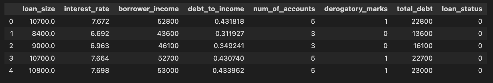
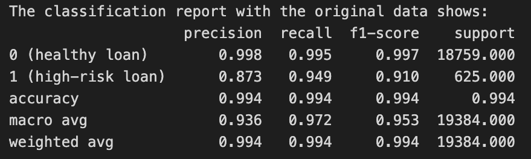

# credit-risk-classification
- Module 20 Challenge
- Steph Abegg

## Credit Risk Analysis Report

In this challenge, we used lending data to build a machine-learning model that evaluates borrowers and identifies their creditworthiness. We used logistic regression, since the predicted variable was the status of a loan, which is a categorial variable (logistic regression is used for creating models for categorical variables). 

## Overview of the Analysis

In this section, describe the analysis you completed for the machine learning models used in this Challenge. This might include:

* Explain the purpose of the analysis.
* Explain what financial information the data was on, and what you needed to predict.
* Provide basic information about the variables you were trying to predict (e.g., `value_counts`).
* Describe the stages of the machine learning process you went through as part of this analysis.
* Briefly touch on any methods you used (e.g., `LogisticRegression`, or any other algorithms).

## Results

Using bulleted lists, describe the accuracy scores and the precision and recall scores of all machine learning models.

* Machine Learning Model 1:
    * Description of Model 1 Accuracy, Precision, and Recall scores.

## Summary

Summarize the results of the machine learning models, and include a recommendation on the model to use, if any. For example:

* Which one seems to perform best? How do you know it performs best?
* Does performance depend on the problem we are trying to solve? (For example, is it more important to predict the `1`'s, or predict the `0`'s? )

If you do not recommend any of the models, please justify your reasoning.

## Overview of the Analysis

0. The analysis is in [credit_risk_classification.ipynb](Credit_Risk/credit_risk_classification.ipynb)

1. The data is in `lending_data.csv`, which contains `loan_size`, `interest_rate`, `borrower_income`, `debt_to_income`, `num_of_accounts`, `derogatory_marks`, `total_debt`, and `loan_status`. The `loan_status` column contains either 0 or 1, where 0 means that the loan is healthy, and 1 means that the loan is at a high risk of defaulting. The data was stored the data in a dataframe. A screenshot of the first five rows of the dataframe is shown below.

   

3. The labels set from the `loan_status` column were stored in the `y` variable and the features DataFrame (all the columns except `loan_status`) were stored in the `X` variable. The "balance" of the labels were checked with `value_counts`. In this dataset, 75036 loans were healthy and 2500 were high-risk.

4. The `train_test_split` module from `sklearn` was used to split the data into training and testing variables: `X_train`, `X_test`, `y_train`, and `y_test`. A `random_state` of 1 was assigned to the function to ensure that the train/test split is consistent, i.e. the same data points are assigned to the training and testing sets across multiple runs of code.

5. A logistic regression model, called `lr_model`, was created using `LogisticRegression()` from the `sklearn` library. The model was fit with the training data, `X_train` and `y_train`. The testing set was then used to make preictions of the testing data labels, `y_pred`, with `predict()` using the testing feature data, `X_test`, and the fitted model, `lr_model`.

6. A confusion matrix for the model was generated using `confusion_matrix()` from `sklearn`, based on `y_test` and `y_pred`.

7. A classification report for the model was obtained with `classification_report()` from `sklearn`, based on `y_test` and `y_pred`.

## Results

Confusion matrix:

|      | Predicted Positive   | Predicted Negative      |
| ------------- | ------------- | ------------- |
| Actual Positive  | 18658  | 107  |
| Actual Negative  |37  | 582  |

Classification report:

   - Accuracy: 0.993.
   - Precision: for healthy loans the precision is 0.998, for high-risk loans the precision is 0.845.
   - Recall: for healthy loans the recall score is 0.994, for high-risk loans the recall score is 0.940.
   - f1-score: for healthy loans the f1-score is 0.996, for high-risk loans the f1-score is 0.890.

## Summary

The accuracy score represents the proportion of correctly predicted labels (both true positives and true negatives) out of the total number of predictions in the test set. The accuracy scores of the logistic regression models with original data and resampled data, respectively, are 0.993 and 0.995. So both models are quite accurate with the resampled data giving slightly higher accuracy.

The balanced accuracy score is the average of recall obtained on each class. It takes into account the performance of the model on both the positive and negative classes, adjusting for class imbalance. The balanced accuracy scores of the logistic regression models with original data and resampled data, respectively, are 0.967 and 0.995. The logistic regression models built on resampled data has higher balanced accuracy (there is an imbalance in the regression model built on original data between its recall for healthy and high-risk loans).

The precision quantifies how many of the positive predictions made by a logistic regression model are actually correct. In other words, precision tells you the proportion of true positives out of all the predicted positives (both true and false). The logistic regression model with original data had precision scores of 0.998 for healthy loans and 0.845 for high-risk loans, while the model with resampled data had precision scores of 0.995 for healthy loans and 0.994 for high-risk loans. So, the logistic regression model with original data was better for predicting healthy loans while the  logistic regression model with resampled data was better for predicting high-risk loans.

Recall, also known as sensitivity or true positive rate, is a metric that quantifies how well a logistic regression model can identify actual positives from the dataset. In other words, it measures the proportion of true positives that were correctly predicted by the model out of all actual positive cases. The lowest recall score of 0.940 is for the prediction of high-risk loans by the logistic regression model with original data, while all other recall scores are 0.994 or higher.

The F1-score is a metric that combines both precision and recall into a single value, providing a balance between the two. It is especially useful when you want to ensure that both false positives and false negatives are minimized, and it's often used when you have an imbalanced dataset. The lowest F1-score of 0.890 is for the prediction of high-risk loans by the logistic regression model with original data, while all other F1-scores are 0.995 or higher.

Model performance depends on the problem we are trying to solve. If we wish to predict the healthy loans the logistic regression model with the original data makes slightly better predictions than the logistic model with resampled data. But the logistic model still does quite well. However, if we need to predict the high-risk loans the linear regression model with the resampled data does much better, with higher precision, recall, and F1-scores.

It is more important to predict high-risk loans, therefore, I would recommend the resampled model because it does a much better job of predicting high-risk loans than the first model and still does a good job predicting healthy loans as well.
